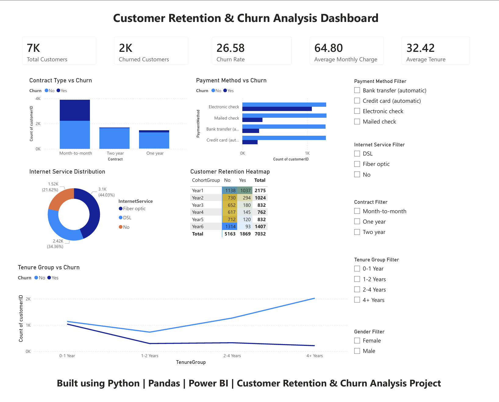

# Customer Retention & Churn Analysis

## Project Overview
This project focuses on analyzing customer retention and churn behavior for a subscription-based business. The objective is to identify customer churn patterns, understand retention drivers, and generate actionable business insights using data analysis and visualization.

This analysis helps businesses understand why customers leave and what strategies can improve long-term retention.

---

## Objectives
- Analyze customer behavior and churn trends
- Identify factors influencing customer retention
- Perform customer segmentation
- Conduct cohort analysis for retention tracking
- Generate business recommendations to reduce churn

---

## Tools & Technologies Used
- Python
- Jupyter Notebook
- Pandas
- NumPy
- Matplotlib
- Seaborn
- Power BI
- Excel

---

## Project Structure

```bash
FUTURE_DS_02/
│
├── dashboard/
│   └── Task 2 output.pbix
│
├── data/
│   ├── raw/
│   └── processed/
│
├── images/
│   └── dashboard_overview.png
│
├── notebooks/
│   ├── 01_data_loading.ipynb
│   ├── 02_data_cleaning.ipynb
│   ├── 03_exploratory_analysis.ipynb
│   ├── 04_customer_segmentation.ipynb
│   ├── 05_cohort_analysis.ipynb
│   └── 06_final_insights.ipynb
│
├── reports/
├── src/
├── main.py
├── requirements.txt
└── README.md
```

---

## Analysis Performed

### 1. Data Loading
Imported and explored the customer dataset for analysis.

### 2. Data Cleaning
Handled missing values, duplicates, formatting issues, and prepared clean data.

### 3. Exploratory Data Analysis
Analyzed:
- Customer demographics
- Subscription behavior
- Usage trends
- Churn distribution

### 4. Customer Segmentation
Grouped customers based on behavior and characteristics for better understanding.

### 5. Cohort Analysis
Tracked customer retention over time to identify engagement patterns.

### 6. Dashboard Creation
Built an interactive Power BI dashboard for business insights visualization.

---

## Key Insights
- Identified customer groups with high churn probability
- Found retention trends across subscription periods
- Recognized patterns affecting customer lifetime value
- Suggested business actions to improve retention

---

## Dashboard Preview
Add your dashboard screenshot here:



---

## Installation

Clone repository:

```bash
git clone https://github.com/shishir-20/FUTURE_DS_02.git
```

Install dependencies:

```bash
pip install -r requirements.txt
```

Run project:

```bash
python main.py
```

---

## Business Impact
This project demonstrates how data analytics can help organizations:
- Reduce customer churn
- Improve retention strategies
- Increase customer lifetime value
- Support data-driven decision making

---

## Author
**Shishir M S**  
GitHub: https://github.com/shishir-20